# Architecture Documentation

## Table of Contents

1. [System Overview](#system-overview)
2. [Component Architecture](#component-architecture)
3. [Data Flow](#data-flow)
4. [Technology Stack](#technology-stack)
5. [Security Architecture](#security-architecture)
6. [Deployment Architecture](#deployment-architecture)
7. [Database Schema](#database-schema)
8. [API Architecture](#api-architecture)

---

## System Overview

The Phishing Awareness Training Platform is a comprehensive security education system designed to help organizations train employees to recognize and respond to phishing attacks.

### High-Level Architecture

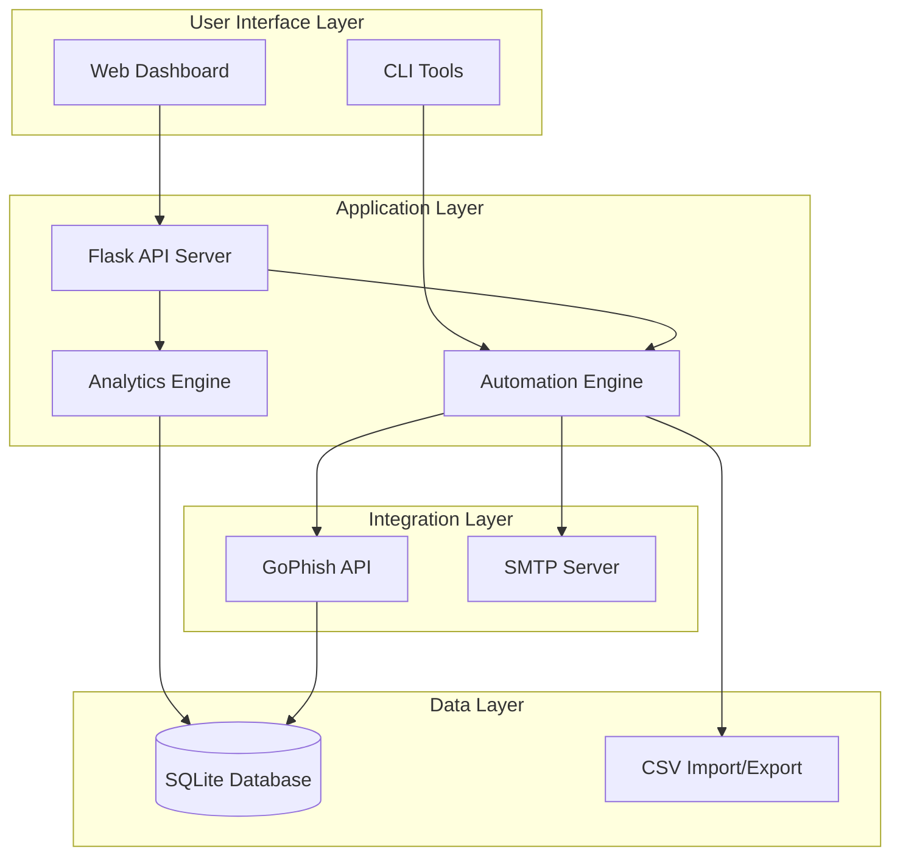
```mermaid
graph TB
    subgraph "User Interface Layer"
        A[Web Dashboard]
        B[CLI Tools]
    end

    subgraph "Application Layer"
        C[Flask API Server]
        D[Automation Engine]
        E[Analytics Engine]
    end

    subgraph "Integration Layer"
        F[GoPhish API]
        G[SMTP Server]
    end

    subgraph "Data Layer"
        H[(SQLite Database)]
        I[CSV Import/Export]
    end

    A --> C
    B --> D
    C --> D
    C --> E
    D --> F
    D --> G
    E --> H
    F --> H
    D --> I
```

### Key Components

- **Web Dashboard**: Flask-based web interface for visualization and management
- **Automation Engine**: Campaign creation and management automation
- **Analytics Engine**: Risk scoring and reporting system
- **GoPhish Integration**: Core phishing simulation platform
- **SMTP Integration**: Training email delivery

---

## Component Architecture

### 1. Dashboard Service

The dashboard provides real-time analytics and campaign management through a REST API.

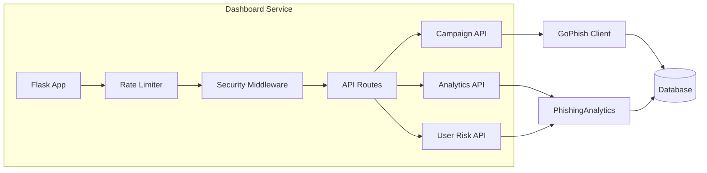
```mermaid
graph LR
    subgraph "Dashboard Service"
        A[Flask App] --> B[Rate Limiter]
        B --> C[Security Middleware]
        C --> D[API Routes]
        D --> E[Campaign API]
        D --> F[Analytics API]
        D --> G[User Risk API]
    end

    E --> H[GoPhish Client]
    F --> I[PhishingAnalytics]
    G --> I
    H --> J[(Database)]
    I --> J
```

**Key Features:**
- RESTful API endpoints
- Rate limiting (60 req/min, 1000 req/hour)
- Security headers (CSP, HSTS, X-Frame-Options)
- CORS protection
- Input validation
- Error handling and logging

### 2. Automation Engine

Handles campaign lifecycle management and automation.

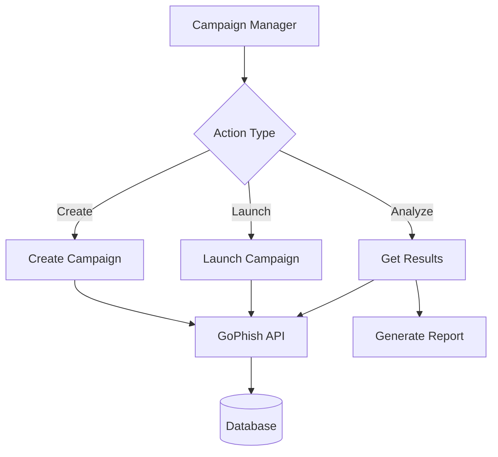
```mermaid
graph TD
    A[Campaign Manager] --> B{Action Type}
    B -->|Create| C[Create Campaign]
    B -->|Launch| D[Launch Campaign]
    B -->|Analyze| E[Get Results]

    C --> F[GoPhish API]
    D --> F
    E --> F

    F --> G[(Database)]
    E --> H[Generate Report]
```

**Components:**
- `campaign_manager.py`: Campaign CRUD operations
- `training_automation.py`: Automated training assignment
- `user_import.py`: Bulk user management

### 3. Analytics Engine

Processes campaign data and calculates risk scores.

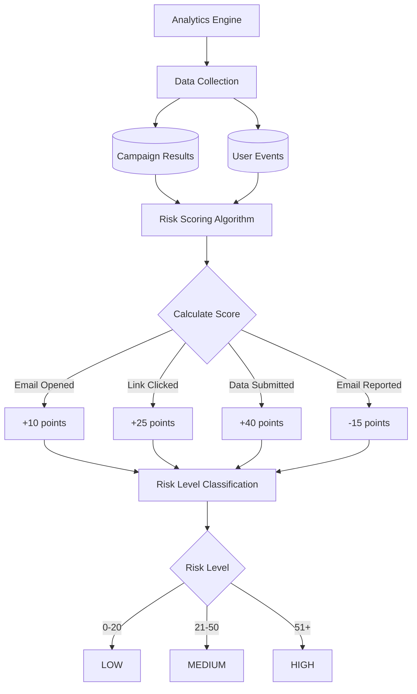
```mermaid
graph TD
    A[Analytics Engine] --> B[Data Collection]
    B --> C[(Campaign Results)]
    B --> D[(User Events)]

    C --> E[Risk Scoring Algorithm]
    D --> E

    E --> F{Calculate Score}
    F -->|Email Opened| G[+10 points]
    F -->|Link Clicked| H[+25 points]
    F -->|Data Submitted| I[+40 points]
    F -->|Email Reported| J[-15 points]

    G --> K[Risk Level Classification]
    H --> K
    I --> K
    J --> K

    K --> L{Risk Level}
    L -->|0-20| M[LOW]
    L -->|21-50| N[MEDIUM]
    L -->|51+| O[HIGH]
```

**Risk Scoring Algorithm:**
```python
# Points assigned per action
POINTS_EMAIL_OPENED = 10
POINTS_LINK_CLICKED = 25
POINTS_DATA_SUBMITTED = 40
POINTS_EMAIL_REPORTED = -15

# Risk level thresholds
RISK_THRESHOLD_LOW = 20
RISK_THRESHOLD_MEDIUM = 50
```

---

## Data Flow

### Campaign Creation and Execution Flow

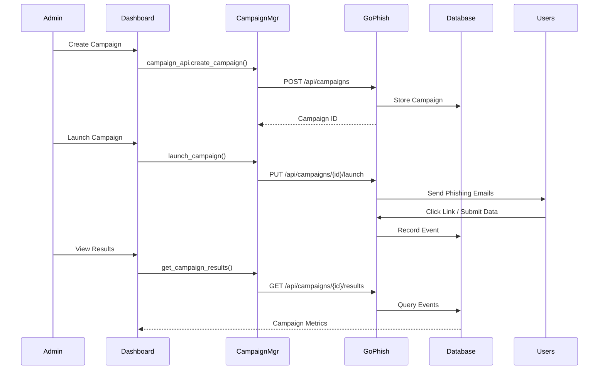
```mermaid
sequenceDiagram
    participant Admin
    participant Dashboard
    participant CampaignMgr
    participant GoPhish
    participant Database
    participant Users

    Admin->>Dashboard: Create Campaign
    Dashboard->>CampaignMgr: campaign_api.create_campaign()
    CampaignMgr->>GoPhish: POST /api/campaigns
    GoPhish->>Database: Store Campaign
    GoPhish-->>CampaignMgr: Campaign ID

    Admin->>Dashboard: Launch Campaign
    Dashboard->>CampaignMgr: launch_campaign()
    CampaignMgr->>GoPhish: PUT /api/campaigns/{id}/launch
    GoPhish->>Users: Send Phishing Emails

    Users->>GoPhish: Click Link / Submit Data
    GoPhish->>Database: Record Event

    Admin->>Dashboard: View Results
    Dashboard->>CampaignMgr: get_campaign_results()
    CampaignMgr->>GoPhish: GET /api/campaigns/{id}/results
    GoPhish->>Database: Query Events
    Database-->>Dashboard: Campaign Metrics
```

### Training Assignment Flow

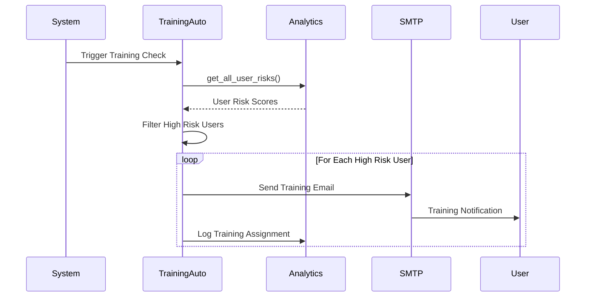
```mermaid
sequenceDiagram
    participant System
    participant TrainingAuto
    participant Analytics
    participant SMTP
    participant User

    System->>TrainingAuto: Trigger Training Check
    TrainingAuto->>Analytics: get_all_user_risks()
    Analytics-->>TrainingAuto: User Risk Scores

    TrainingAuto->>TrainingAuto: Filter High Risk Users

    loop For Each High Risk User
        TrainingAuto->>SMTP: Send Training Email
        SMTP->>User: Training Notification
        TrainingAuto->>Analytics: Log Training Assignment
    end
```

### Analytics and Reporting Flow

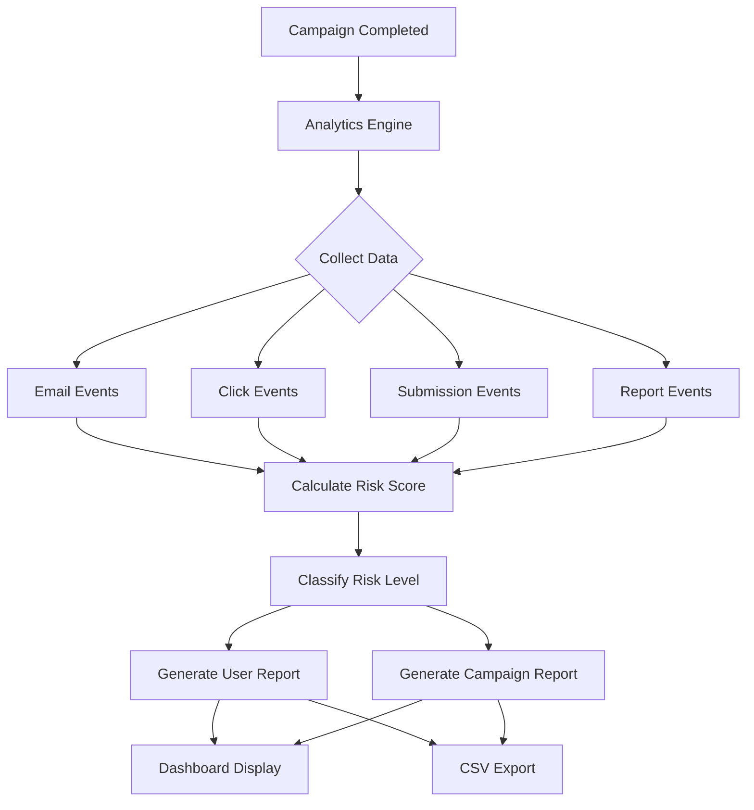
```mermaid
flowchart TD
    A[Campaign Completed] --> B[Analytics Engine]
    B --> C{Collect Data}

    C --> D[Email Events]
    C --> E[Click Events]
    C --> F[Submission Events]
    C --> G[Report Events]

    D --> H[Calculate Risk Score]
    E --> H
    F --> H
    G --> H

    H --> I[Classify Risk Level]
    I --> J[Generate User Report]
    I --> K[Generate Campaign Report]

    J --> L[Dashboard Display]
    K --> L

    J --> M[CSV Export]
    K --> M
```

---

## Technology Stack

### Backend

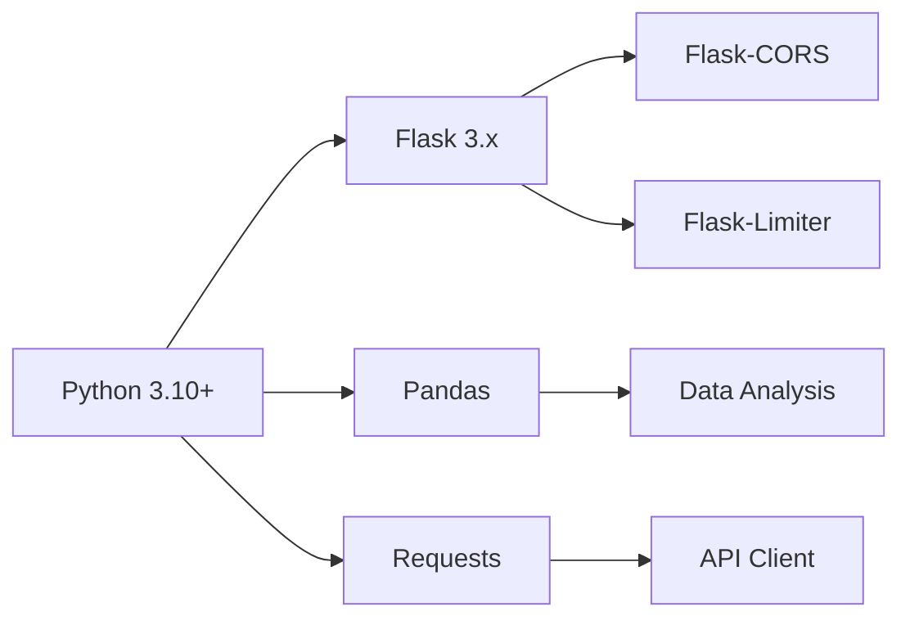
```mermaid
graph LR
    A[Python 3.10+] --> B[Flask 3.x]
    A --> C[Pandas]
    A --> D[Requests]

    B --> E[Flask-CORS]
    B --> F[Flask-Limiter]

    C --> G[Data Analysis]
    D --> H[API Client]
```

**Core Technologies:**
- **Python 3.10+**: Primary programming language
- **Flask 3.x**: Web framework for API and dashboard
- **Pandas**: Data analysis and risk scoring
- **GoPhish API**: Phishing simulation platform
- **SQLite**: Database (upgradeable to PostgreSQL)

**Security & Middleware:**
- **Flask-Limiter**: Rate limiting
- **Flask-CORS**: Cross-origin resource sharing
- **PyYAML**: Configuration management
- **python-dotenv**: Environment variable management

**Development Tools:**
- **pytest**: Testing framework
- **black**: Code formatting
- **mypy**: Type checking
- **flake8**: Linting
- **bandit**: Security scanning

### Frontend (Dashboard)

- **HTML5/CSS3**: Structure and styling
- **Plotly.js**: Interactive charts and visualizations
- **Bootstrap**: UI components (optional)
- **Vanilla JavaScript**: Dynamic interactions

---

## Security Architecture

### Defense in Depth

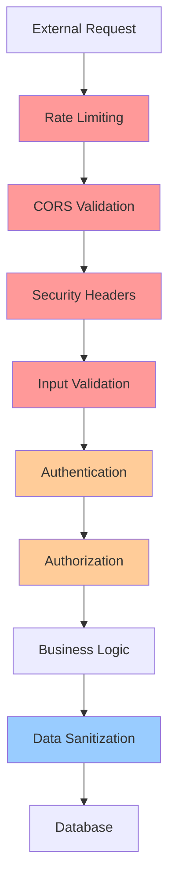
```mermaid
graph TD
    A[External Request] --> B[Rate Limiting]
    B --> C[CORS Validation]
    C --> D[Security Headers]
    D --> E[Input Validation]
    E --> F[Authentication]
    F --> G[Authorization]
    G --> H[Business Logic]
    H --> I[Data Sanitization]
    I --> J[Database]

    style B fill:#ff9999
    style C fill:#ff9999
    style D fill:#ff9999
    style E fill:#ff9999
    style F fill:#ffcc99
    style G fill:#ffcc99
    style I fill:#99ccff
```

### Security Layers

#### 1. Network Security
- Rate limiting: 60 requests/min, 1000 requests/hour
- CORS restrictions to allowed origins only
- HTTPS enforcement (HSTS)

#### 2. Request Security
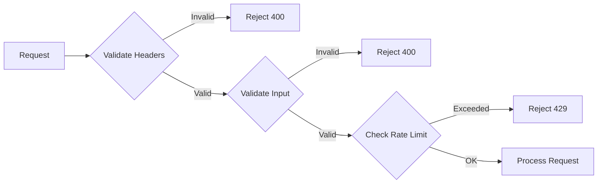
```mermaid
graph LR
    A[Request] --> B{Validate Headers}
    B -->|Invalid| C[Reject 400]
    B -->|Valid| D{Validate Input}
    D -->|Invalid| E[Reject 400]
    D -->|Valid| F{Check Rate Limit}
    F -->|Exceeded| G[Reject 429]
    F -->|OK| H[Process Request]
```

**Security Headers:**
```python
X-Content-Type-Options: nosniff
X-Frame-Options: DENY
X-XSS-Protection: 1; mode=block
Strict-Transport-Security: max-age=31536000; includeSubDomains
Content-Security-Policy: default-src 'self'
Referrer-Policy: strict-origin-when-cross-origin
Permissions-Policy: geolocation=(), microphone=(), camera=()
```

#### 3. Input Validation
- Email format validation
- Integer range validation
- String sanitization (XSS prevention)
- Path parameter validation
- SQL injection prevention

#### 4. Authentication (Planned)
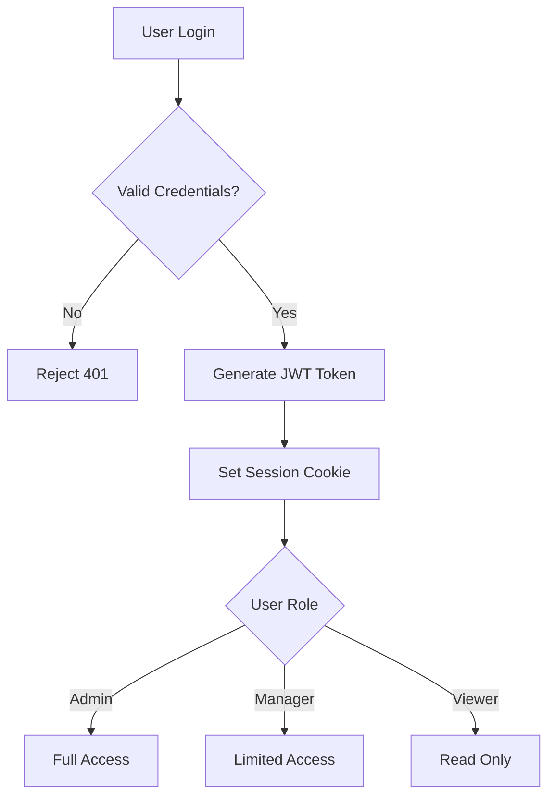
```mermaid
graph TD
    A[User Login] --> B{Valid Credentials?}
    B -->|No| C[Reject 401]
    B -->|Yes| D[Generate JWT Token]
    D --> E[Set Session Cookie]
    E --> F{User Role}
    F -->|Admin| G[Full Access]
    F -->|Manager| H[Limited Access]
    F -->|Viewer| I[Read Only]
```

---

## Deployment Architecture

### Single Server Deployment

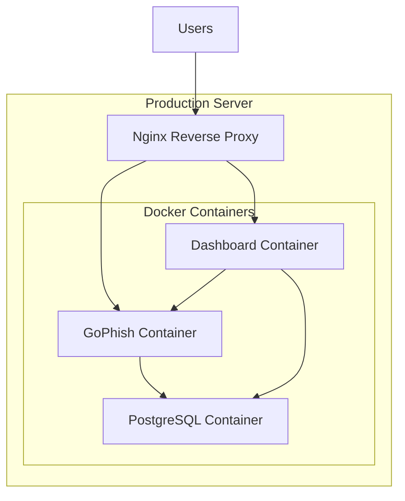
```mermaid
graph TB
    subgraph "Production Server"
        A[Nginx Reverse Proxy]

        subgraph "Docker Containers"
            B[GoPhish Container]
            C[Dashboard Container]
            D[PostgreSQL Container]
        end
    end

    E[Users] --> A
    A --> B
    A --> C
    C --> B
    B --> D
    C --> D
```

### High Availability Deployment

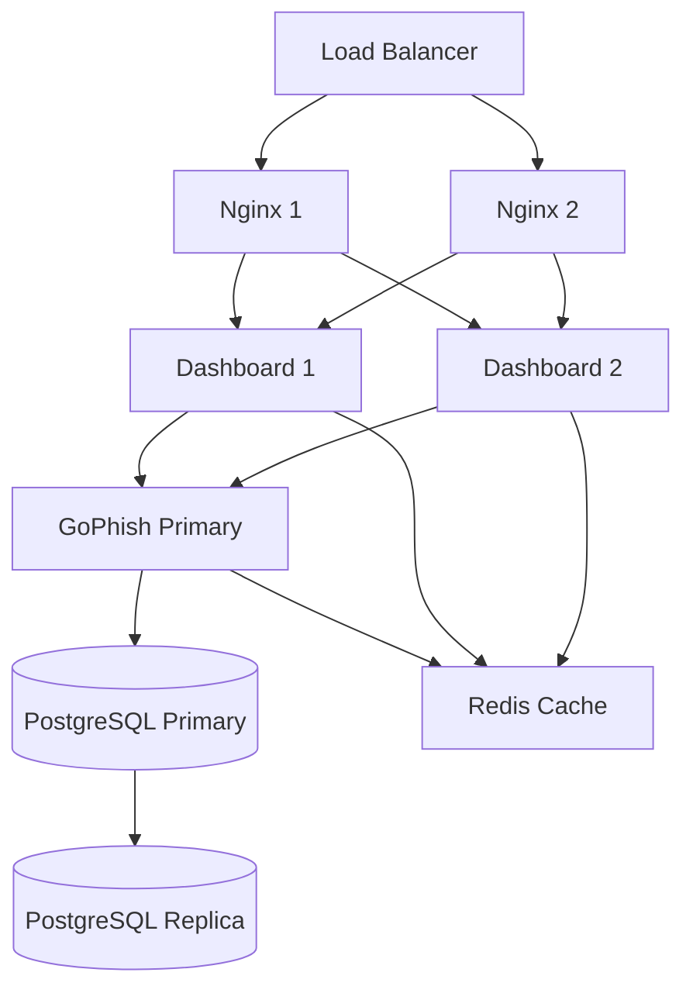
```mermaid
graph TB
    A[Load Balancer] --> B[Nginx 1]
    A --> C[Nginx 2]

    B --> D[Dashboard 1]
    B --> E[Dashboard 2]
    C --> D
    C --> E

    D --> F[GoPhish Primary]
    E --> F

    F --> G[(PostgreSQL Primary)]
    G --> H[(PostgreSQL Replica)]

    F --> I[Redis Cache]
    D --> I
    E --> I
```

### Container Architecture

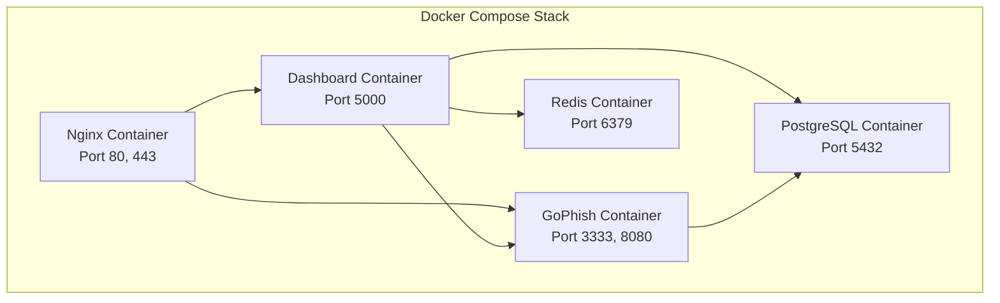
```mermaid
graph TD
    subgraph "Docker Compose Stack"
        A[Nginx Container<br/>Port 80, 443]
        B[Dashboard Container<br/>Port 5000]
        C[GoPhish Container<br/>Port 3333, 8080]
        D[PostgreSQL Container<br/>Port 5432]
        E[Redis Container<br/>Port 6379]
    end

    A --> B
    A --> C
    B --> C
    B --> D
    B --> E
    C --> D
```

---

## Database Schema

### GoPhish Database (SQLite/PostgreSQL)

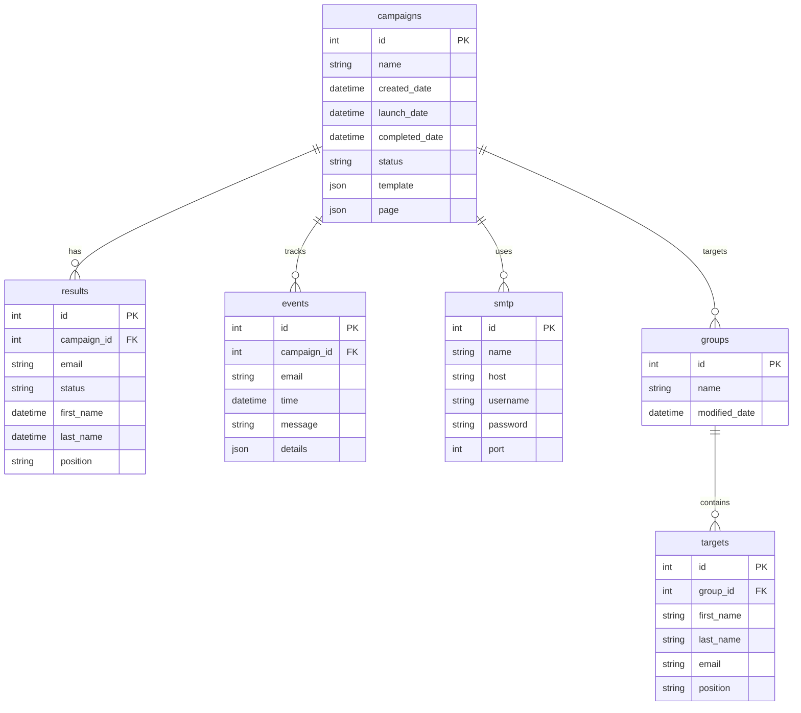
```mermaid
erDiagram
    campaigns ||--o{ results : has
    campaigns ||--o{ events : tracks
    campaigns ||--o{ smtp : uses
    groups ||--o{ targets : contains
    campaigns ||--o{ groups : targets

    campaigns {
        int id PK
        string name
        datetime created_date
        datetime launch_date
        datetime completed_date
        string status
        json template
        json page
    }

    results {
        int id PK
        int campaign_id FK
        string email
        string status
        datetime first_name
        datetime last_name
        string position
    }

    events {
        int id PK
        int campaign_id FK
        string email
        datetime time
        string message
        json details
    }

    groups {
        int id PK
        string name
        datetime modified_date
    }

    targets {
        int id PK
        int group_id FK
        string first_name
        string last_name
        string email
        string position
    }

    smtp {
        int id PK
        string name
        string host
        string username
        string password
        int port
    }
```

### Analytics Data Model

```python
# Risk Score Calculation
risk_score = (
    (opened_count * POINTS_EMAIL_OPENED) +
    (clicked_count * POINTS_LINK_CLICKED) +
    (submitted_count * POINTS_DATA_SUBMITTED) +
    (reported_count * POINTS_EMAIL_REPORTED)
)

# Risk Level Classification
if risk_score < RISK_THRESHOLD_LOW:
    risk_level = "LOW"
elif risk_score < RISK_THRESHOLD_MEDIUM:
    risk_level = "MEDIUM"
else:
    risk_level = "HIGH"
```

---

## API Architecture

### REST API Endpoints

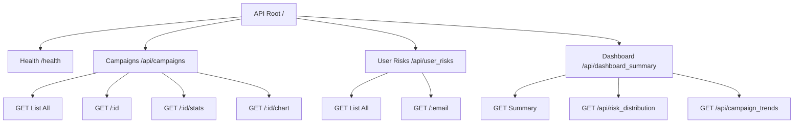
```mermaid
graph TD
    A[API Root /] --> B[Health /health]
    A --> C[Campaigns /api/campaigns]
    A --> D[User Risks /api/user_risks]
    A --> E[Dashboard /api/dashboard_summary]

    C --> F[GET List All]
    C --> G[GET /:id]
    C --> H[GET /:id/stats]
    C --> I[GET /:id/chart]

    D --> J[GET List All]
    D --> K[GET /:email]

    E --> L[GET Summary]
    E --> M[GET /api/risk_distribution]
    E --> N[GET /api/campaign_trends]
```

### API Documentation

#### Campaign Endpoints

**GET /api/campaigns**
```json
Response: [
  {
    "id": 1,
    "name": "Q1 Phishing Test",
    "status": "Completed",
    "created_date": "2025-01-01T10:00:00Z",
    "launch_date": "2025-01-02T09:00:00Z",
    "completed_date": "2025-01-15T17:00:00Z"
  }
]
```

**GET /api/campaign/:id/stats**
```json
Response: {
  "emails_sent": 100,
  "emails_opened": 45,
  "links_clicked": 23,
  "data_submitted": 8,
  "reported": 12,
  "open_rate": 45.0,
  "click_rate": 23.0,
  "submit_rate": 8.0,
  "report_rate": 12.0
}
```

#### User Risk Endpoints

**GET /api/user_risks**
```json
Response: [
  {
    "email": "user@example.com",
    "risk_score": 65,
    "risk_level": "HIGH",
    "emails_opened": 2,
    "links_clicked": 1,
    "data_submitted": 1,
    "reported": 0
  }
]
```

#### Dashboard Endpoints

**GET /api/dashboard_summary**
```json
Response: {
  "total_campaigns": 5,
  "active_campaigns": 1,
  "completed_campaigns": 4,
  "total_users": 150,
  "high_risk_users": 23,
  "total_emails_sent": 500,
  "overall_open_rate": 42.5,
  "overall_click_rate": 18.2,
  "overall_submit_rate": 6.4,
  "last_updated": "2025-01-14T15:30:00Z"
}
```

### Request/Response Flow

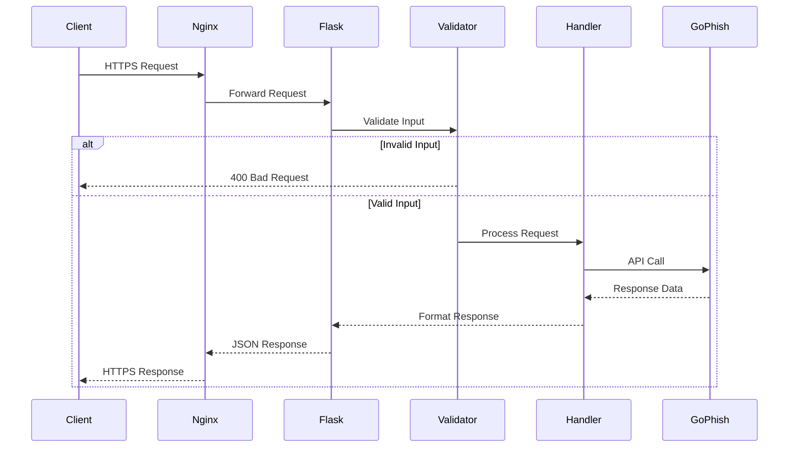
```mermaid
sequenceDiagram
    participant Client
    participant Nginx
    participant Flask
    participant Validator
    participant Handler
    participant GoPhish

    Client->>Nginx: HTTPS Request
    Nginx->>Flask: Forward Request
    Flask->>Validator: Validate Input

    alt Invalid Input
        Validator-->>Client: 400 Bad Request
    else Valid Input
        Validator->>Handler: Process Request
        Handler->>GoPhish: API Call
        GoPhish-->>Handler: Response Data
        Handler-->>Flask: Format Response
        Flask-->>Nginx: JSON Response
        Nginx-->>Client: HTTPS Response
    end
```

---

## Performance Considerations

### Caching Strategy

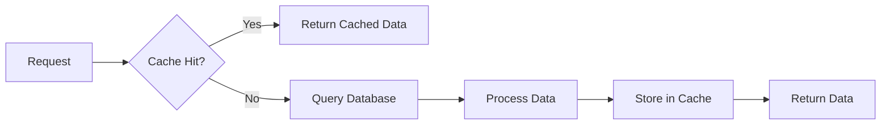
```mermaid
graph LR
    A[Request] --> B{Cache Hit?}
    B -->|Yes| C[Return Cached Data]
    B -->|No| D[Query Database]
    D --> E[Process Data]
    E --> F[Store in Cache]
    F --> G[Return Data]
```

**Cacheable Endpoints:**
- Dashboard summary (5 min TTL)
- Campaign list (1 min TTL)
- Risk distribution (5 min TTL)
- Campaign trends (10 min TTL)

### Database Optimization

- Indexed fields: `campaign_id`, `email`, `status`, `created_date`
- Connection pooling for concurrent requests
- Query result pagination
- Lazy loading for large datasets

---

## Monitoring and Observability

### Monitoring Stack (Planned)

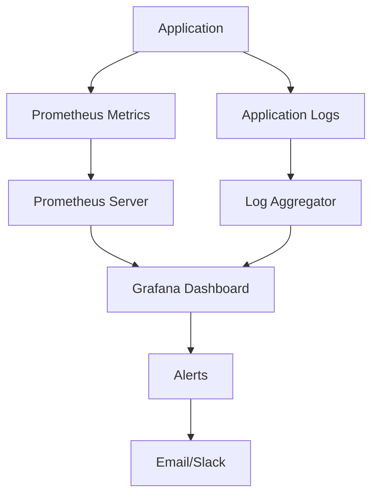
```mermaid
graph TD
    A[Application] --> B[Prometheus Metrics]
    A --> C[Application Logs]

    B --> D[Prometheus Server]
    C --> E[Log Aggregator]

    D --> F[Grafana Dashboard]
    E --> F

    F --> G[Alerts]
    G --> H[Email/Slack]
```

### Key Metrics

- Request rate and latency
- Error rate by endpoint
- Campaign success rates
- Database query performance
- Memory and CPU usage
- Active user sessions

---

## Scalability Considerations

### Horizontal Scaling

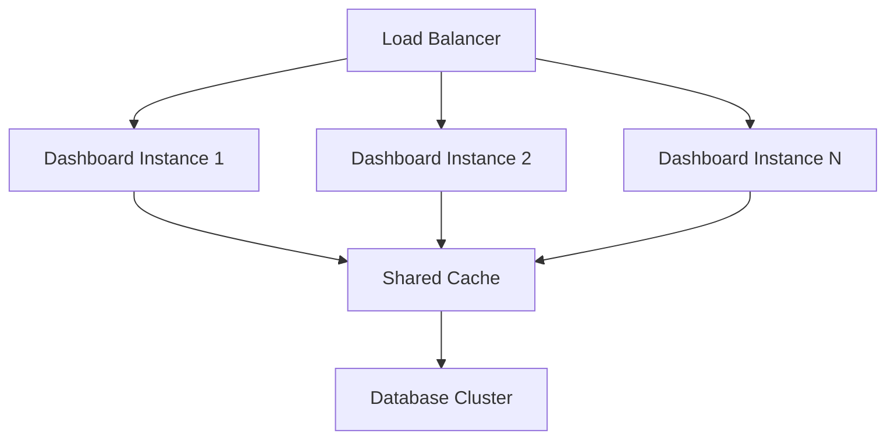
```mermaid
graph TD
    A[Load Balancer] --> B[Dashboard Instance 1]
    A --> C[Dashboard Instance 2]
    A --> D[Dashboard Instance N]

    B --> E[Shared Cache]
    C --> E
    D --> E

    E --> F[Database Cluster]
```

**Scaling Strategy:**
1. Stateless application design
2. Shared cache (Redis)
3. Load balancing across instances
4. Database read replicas
5. CDN for static assets

---

## Future Architecture Enhancements

### Planned Improvements

1. **Microservices Architecture**
   - Separate campaign, analytics, and training services
   - Event-driven communication (Kafka/RabbitMQ)
   - Independent scaling per service

2. **Advanced Analytics**
   - Machine learning risk prediction
   - Real-time event streaming
   - Behavioral analysis

3. **Multi-Tenancy**
   - Tenant isolation
   - Shared resource management
   - Custom branding per tenant

---

## References

- [Flask Documentation](https://flask.palletsprojects.com/)
- [GoPhish API Documentation](https://docs.getgophish.com/api-documentation/)
- [OWASP Security Guidelines](https://owasp.org/)
- [12-Factor App Methodology](https://12factor.net/)
